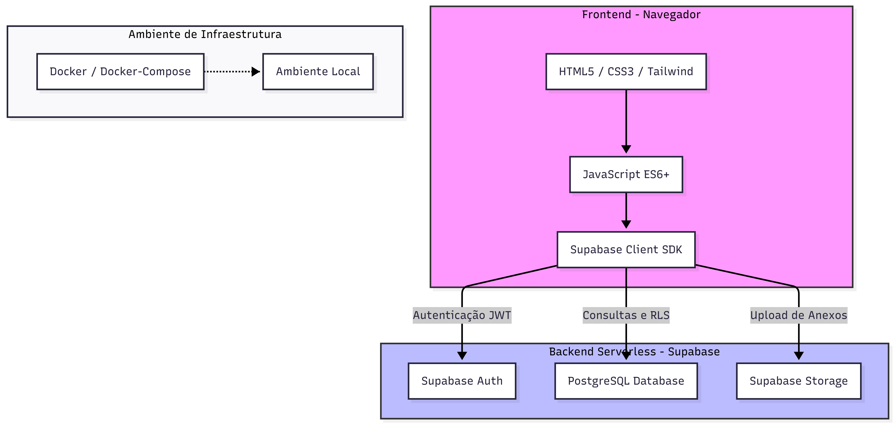

# 🛠️ IFAL-HelpDesk

O **IFAL-HelpDesk** é um sistema de gerenciamento de chamados e suporte (Help Desk) desenvolvido para otimizar o atendimento e a resolução de problemas tecnológicos ou administrativos. O projeto conta com uma interface web fluida e integração com serviços em nuvem para persistência de dados.

## 🌐 Sistema Online

O sistema está disponível online em: [https://ifal-helpdesk.onrender.com](https://ifal-helpdesk.onrender.com)

## 🏗️ Arquitetura do Sistema



---

## 🚀 Tecnologias Utilizadas

O projeto foi construído utilizando as seguintes tecnologias:

* **Front-end:** HTML5, CSS3, JavaScript (ES6+)
* **Ferramenta de Build:** [Vite](https://vitejs.dev/) (para um ambiente de desenvolvimento rápido e otimização de build)
* **Backend as a Service (BaaS):** [Supabase](https://supabase.com/) (utilizado para autenticação de usuários e banco de dados PostgreSQL)

---

## 📂 Estrutura de Páginas do Sistema

O sistema é composto pelas seguintes telas e módulos principais:

* `index.html`: Página inicial/Landing page do sistema.
* `login.html`: Tela de autenticação e acesso seguro de usuários.
* `dashboard.html`: Painel principal com visão geral dos chamados e métricas.
* `abrir-chamado.html`: Formulário para a criação de novas solicitações de suporte.
* `chamados.html`: Listagem e gerenciamento de todos os chamados abertos.
* `detalhes.html`: Visualização detalhada de um chamado específico.
* `conhecimento.html`: Base de conhecimento com artigos e soluções frequentes.
* `relatorios.html`: Módulo de relatórios e análise de dados de atendimento.
* `equipe.html`: Gerenciamento ou visualização dos membros da equipe de suporte.
* `visao.md`: Documento com a visão geral e regras de negócio do projeto.

---

## ⚙️ Pré-requisitos

Antes de começar, você vai precisar ter instalado em sua máquina:
* [Node.js](https://nodejs.org/en) (versão 12 ou superior recomendada)
* Um gerenciador de pacotes como o **NPM** (já vem com o Node)
* [Docker](https://www.docker.com/get-started) (versão 20.10 ou superior)
* [Docker Compose](https://docs.docker.com/compose/install/) (versão 2.0 ou superior)

---

## 🐳 Como Rodar o Docker Localmente

Para rodar o projeto via Docker, basta abrir o terminal e executar:

```bash
cd docker && docker-compose up --build
```

A aplicação estará disponível em: `http://localhost:8080`

**Para parar os containers:**
```bash
cd docker && docker-compose down
```

**Observações importantes:**
- A aplicação estará disponível na porta 8080 do seu computador
- As alterações nos arquivos serão refletidas automaticamente (hot-reload)
- O Docker Compose gerencia automaticamente as dependências e configurações

---

## 🚀 Como Executar em Produção com Docker

Para rodar o projeto em modo de produção (build otimizado):

1. **Execute o Docker Compose de produção:**
   ```bash
   docker-compose -f docker/docker-compose.prod.yml up -d
   ```

2. **Acesse a aplicação:**
   Abra seu navegador e acesse: `http://localhost:80`

3. **Para parar os containers:**
   ```bash
   docker-compose -f docker/docker-compose.prod.yml down
   ```

**Diferenças entre desenvolvimento e produção:**
- Desenvolvimento: Hot-reload, porta 8080, Vite dev server
- Produção: Build otimizado, porta 80, Nginx estático

---

## 🛠️ Como Executar o Projeto Localmente (Sem Docker)

Siga os passos abaixo para rodar o projeto em seu ambiente de desenvolvimento:

1. **Clone o repositório:**
   ```bash
   git clone https://github.com/isabellalimaifal/IFAL-HelpDesk.git
   ```

2. **Entre no diretório do projeto:**
   ```bash
   cd IFAL-HelpDesk
   ```

3. **Instale as dependências:**
   ```bash
   npm install
   ```

4. **Inicie o servidor de desenvolvimento:**
   ```bash
   npm run dev
   ```

5. **Acesse a aplicação:**
   Abra seu navegador e acesse: `http://localhost:5173`

---

## 🔐 Credenciais de Teste

O sistema possui controle automático de permissões baseado no domínio do e-mail:

* **Contas normais:** Entram automaticamente como **Aluno** com permissão para visualizar e criar chamados
* **E-mails com domínio @tec.ifal.edu.br:** Entram automaticamente como **Técnico** com permissão adicional para alterar status de chamados e realizar ações administrativas

Para testes, você pode criar contas de teste com os seguintes padrões de e-mail:
- Aluno: `aluno.teste@email.com`
- Técnico: `tecnico.teste@tec.ifal.edu.br`

---

## 📝 Próximos Passos

Para continuar o desenvolvimento do projeto, consulte o documento `visao.md` para entender a visão geral e as regras de negócio do sistema.

---

## 🤝 Contribuindo

Contribuições são bem-vindas! Por favor, abra uma *issue* ou *pull request* para melhorias.

---

## 📄 Licença

Este projeto está sob a licença MIT.
